# AWS VPC Project Screenshots

This folder contains the visual proof and setup screenshots for the AWS VPC project.

## Folder Overview

- `VPC/` contains VPC, subnet, route table, and networking screenshots
- `SG/` contains security group screenshots
- `EC2 & ASG/` contains EC2 instance and Auto Scaling Group screenshots
- `Launch template/` contains launch template screenshots
- `Load Balancer/` contains ALB and target group screenshots
- `Teminal/` contains terminal validation screenshots

## VPC

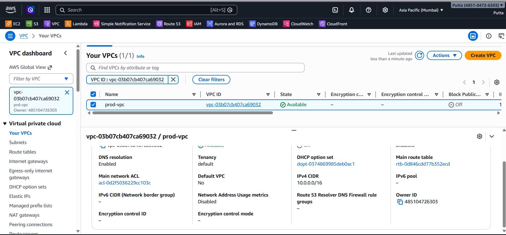
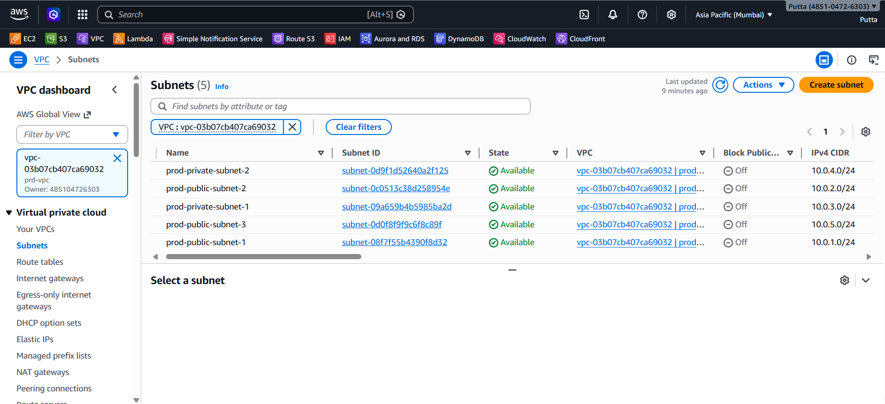
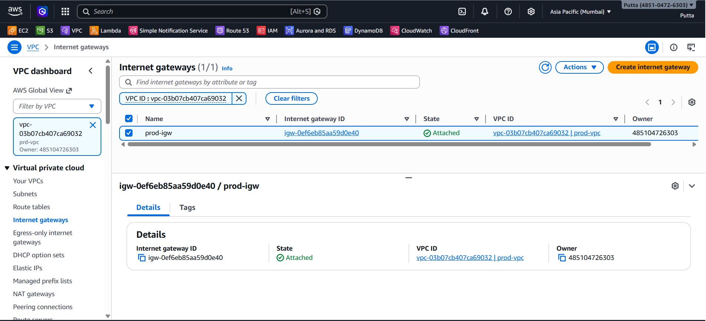
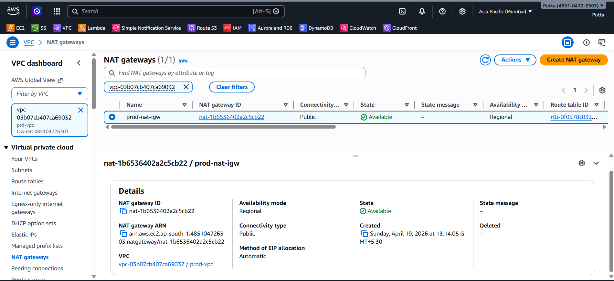
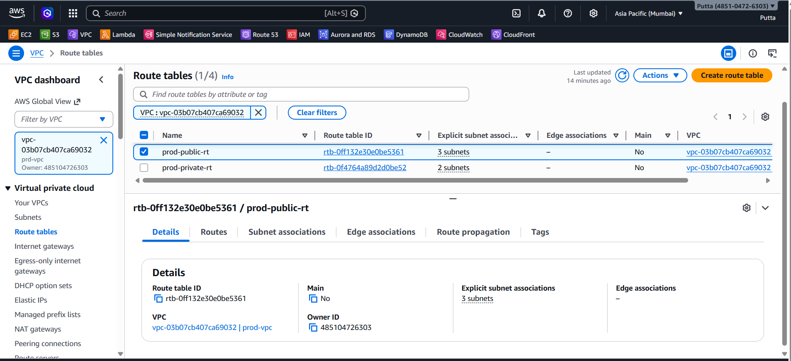
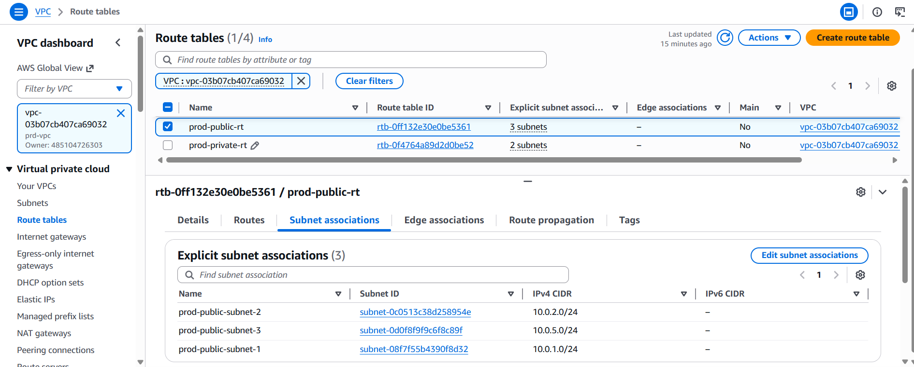
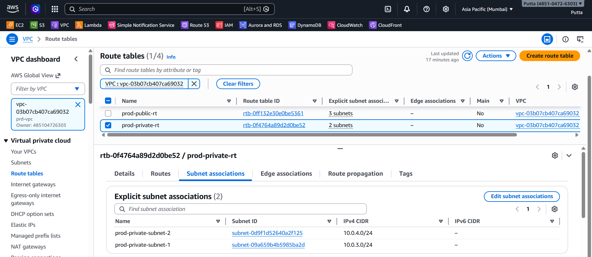
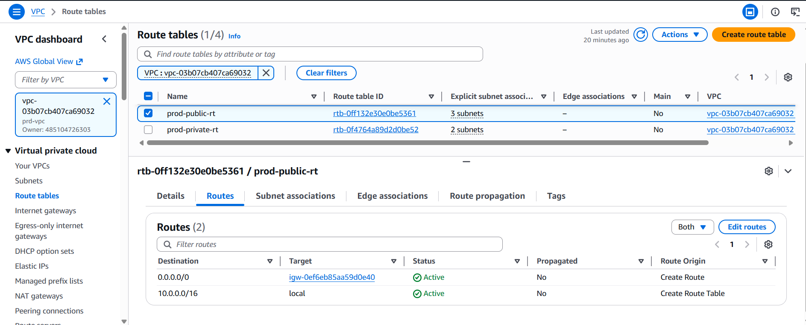
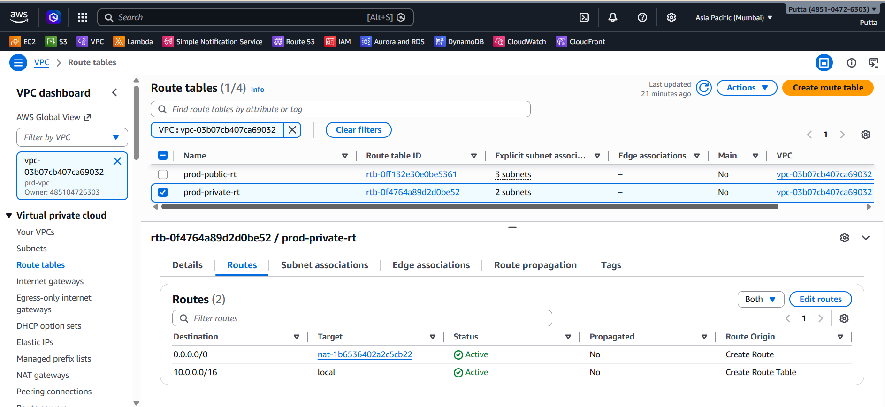

## Security Groups

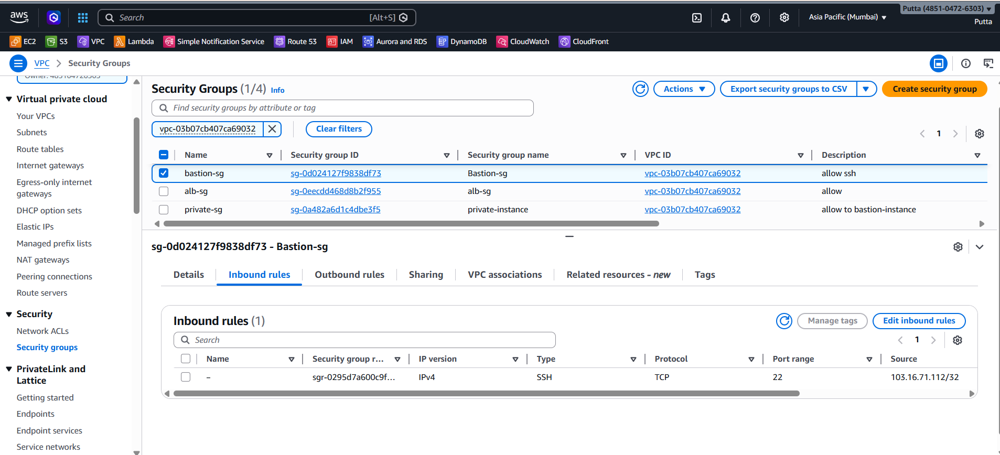
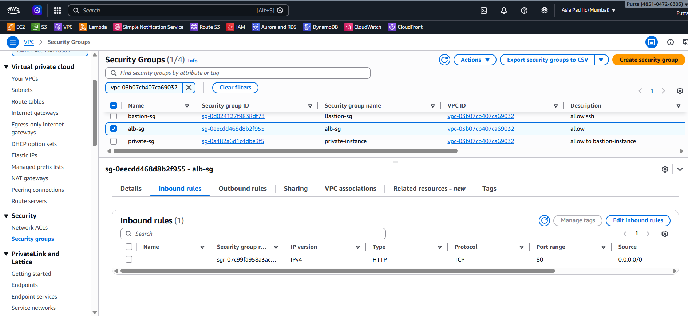
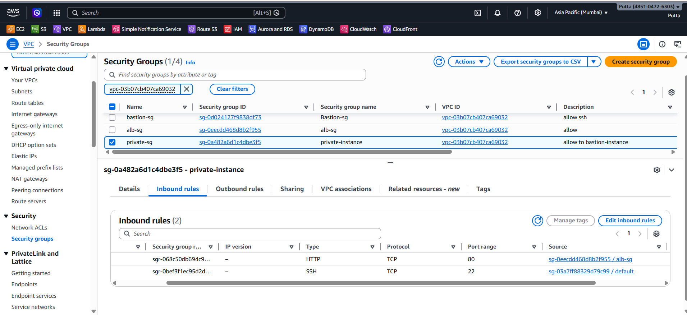

## EC2 And Auto Scaling

## Launch Template

## Load Balancer

## Terminal Validation

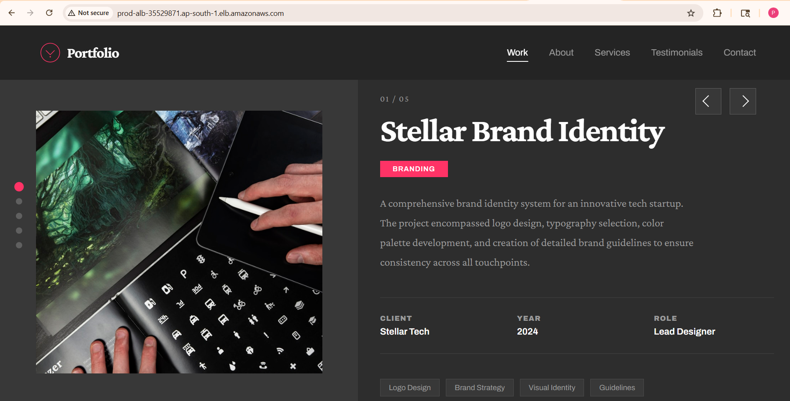
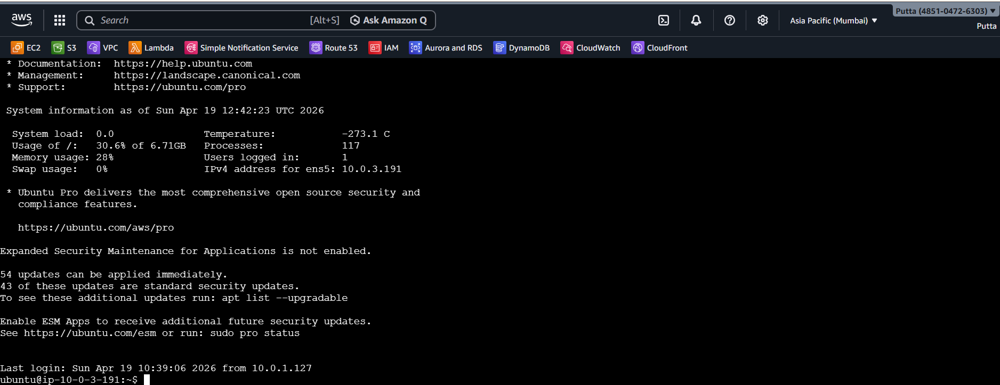

## Author

**Prateek Kulkarni**
